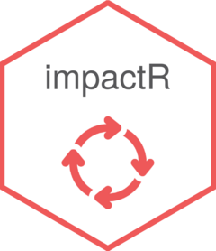

<!-- README.md is generated from README.Rmd. Please edit that file -->

```{r, include = FALSE}
knitr::opts_chunk$set(
  collapse = TRUE,
  comment = "#>",
  fig.path = "man/figures/README-",
  out.width = "100%"
)

desc = read.dcf('DESCRIPTION')
desc = setNames(as.list(desc), colnames(desc))
```

# `r desc$Package` 

> `r desc$Title`


`impactR` started as a simple project: mainly a reminder of
totally-perfectible functions used and made on the go for the Burkina
Faso mission in 2021.

It became broader, aiming now to ease data teams daily R work as follows:

-   *utils.R* - functions used on an everyday basis (import a xlsx file, recode NAs, get column names starting with a pattern)
-   *monitor.R* - functions to produce logs and help monitoring data
    collection (logical tests, outliers, other answers)
-   *clean.R* - functions that uses the same logs to clean the dataset
-   *analysis.R* - functions to calculate optimums, weighted proportions and
    interactions, pivot tables reports
-   *plots.R* - plot functions and REACH themes (colors, fonts)
-   *maps.R* - some utils (e.g. ease bbox) and some themes (for
    `tmap`)

Documentation is on the edge of being written (French and English version)

Specs:

-   mainly using Kobo collection and the `tidyverse` for most, `srvyr` for survey data analysis,
    `janitor`, `tmap`
-   it requires R 4.1+ (mostly for the native pipe `|>`).

## Installation

You can install the last version of impactR from
[GitHub](https://github.com/) with:

```{r, eval = FALSE}
# install.packages("devtools")
devtools::install_github("gnoblet/impactR")
```

## Roadmap

From version 0.6, contributions should go with minimal and complete commits as a good practice. The `dev` branch will be used from there. Well, in practice, it isn't much.

Roadmap is as follows:

- [X] (done ?) introduce tidy eval wherever it makes sense
- [X] add (re) count columns post-cleaning for multiple choices columns and simple choice's other column
- [ ] write more documentaion
- [ ] tidy eval to cleaning functions
- [ ] dots not as the last arg, not always at least
- [ ] functions to create a small report of the values that effectively changed or were removed when cleaning thanks to a cleaning log
- [ ] more plotting functions
- [ ] (ongoing) MSNA analysis tools : roster (education, demography, WGI), weighting functions, analysis functions
- [ ] (maybe) Split this big mess into several consolidated small packages : a viz one, an analysis one and a cleaning one


## Side projects

There will be a Shiny app for cleaning and monitoring (in French for now) whose repo will be [collectoR](https://github.com/gnoblet/collectoR). It is experimental and based on older versions of `impactR.`

## Vignettes

Youpi! some documentation:

- [The main vignette for the main workflow (en version)](https://gnoblet.github.io/impactR/articles/base_de_travail.html)
- [The main vignette for the main workflow (fr version)](https://gnoblet.github.io/impactR/articles/main_workflow.html)

## Example

These are basics example of daily uses:


```{r, eval = F}
# Attach all functions, equivalent to library("impactR")
box::use(impactR[...])

## basic example codes and uses (not run!)

## Import a csv file with clean names and clean types
# import_csv("data.csv")

## Get colnames for sector foodsec whose variables start with "f_"
# tbl_col_start(data, "f_")

## Bbox with a buffer (useful to add compass, scale_bar, legends to a map)
# buffer_bbox(admin1_sf, buffer = 0.05)

## Make an outlier log for all numeric variables in the data.frame/tibble
# make_log_outlier(rawdata, survey, id_col = uuid, i_enum_id)

## Make a log based on logical tests, outliers and "other" answers
# make_all_logs(rawdata, 
#               survey, 
#               check_list,
#               other = "other_", 
#               id_col = uuid, 
#               i_enum_id)

## Recode parent "other" from a well-filled cleaning log
# recode_other_parent_from_log(data, log, id_col = "uuid")

## Calculate weigthed proportion for shelter type by group (e.g. administrative areas or population groups)
# svy_prop(design, s_shelter_type, c(admin1, group_pop), na.rm = T, stat_name = "prop", level = 0.95)
```
